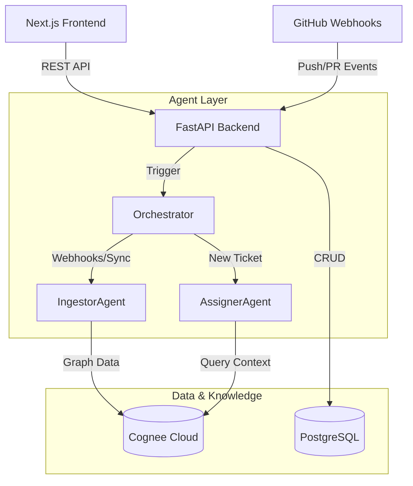

# Smart Ticket AI - System Architecture

Smart Ticket AI is a next-generation ticketing system that leverages **Google ADK (Agent Development Kit)** and **Cognee Cloud** to autonomously analyze, ingest, and assign incoming bugs and feature requests. 

This document outlines the detailed architecture and lifecycle of the application.

---

## 1. High-Level Architecture

The system is comprised of three primary layers:
1. **Frontend (Next.js)**: A sleek, modern UI utilizing React, Tailwind CSS, and NextAuth for GitHub Authentication and role-based access.
2. **Backend API (FastAPI)**: Serves as the core engine that handles user requests, GitHub Webhooks, and orchestrates background AI agents.
3. **AI Agent Layer (Google ADK & Cognee)**: Autonomous AI agents responsible for ingesting GitHub data into a knowledge graph and making intelligent, contextual developer assignments.

### Architecture Diagram

---

## 2. Core Components

### 2.1 Webhooks & The IngestorAgent
When a repository is linked to the platform, we set up a GitHub webhook. 
1. **Event Reception**: When a developer pushes code or opens a PR, GitHub fires a webhook payload to `/webhooks/github/{owner}/{repo_name}`.
2. **Historical Sync & Chunking**: To ensure high-quality graph completion, the system uses the `github_client` to extract full commit patches, metadata, and authors, formatting them into rich Markdown documents.
3. **Knowledge Graph**: The `IngestorAgent` parses this Markdown and uses Cognee Cloud to inject this information via the `memory_service.add_repository_data` endpoint. Cognee then `cognify`'s the data into a semantic knowledge graph. This builds a deep understanding of *who* wrote *which* code.

### 2.2 Ticketing & The AssignerAgent
When a client or manager reports a bug through the UI:
1. **Ticket Creation**: The ticket is saved to the PostgreSQL database with an "Open" or "Triage" status.
2. **Rate-Limited Background Processing**: To avoid hitting LLM API rate limits, a persistent background loop (`process_tickets_rate_limited`) polls for unassigned tickets. It executes the synchronous `AssignerAgent` securely within a separate threadpool to avoid blocking FastAPI's main async event loop.
3. **Contextual Retrieval**: The agent reads the ticket description and queries the Cognee memory graph using the actual GitHub repository name (e.g., `owner/repo`) as the dataset name. It finds out which developer most recently touched the related files or systems.
4. **Autonomous Assignment**: The agent formulates an `AssignmentRecommendation` containing a confidence score and the exact evidence (e.g., commit hashes and file paths). It then automatically assigns the ticket to the most relevant developer.

---

## 3. Technology Stack

- **Frameworks**: Next.js 14+ (App Router), FastAPI
- **AI Tooling**: Google ADK (Agent Development Kit), Google Gemini (gemini-3.5-flash)
- **Memory & Vector Store**: Cognee Cloud (Semantic Knowledge Graph)
- **Database**: PostgreSQL (SQLAlchemy ORM)
- **Styling**: Tailwind CSS v4, Framer Motion, Glassmorphism Aesthetics
- **Authentication**: NextAuth (Auth.js) with GitHub OAuth

---

## 4. Agent Tooling

Our agents leverage specific tools defined in `packages/agents/tools.py` using Google ADK's `FunctionTool`:

1. **`add_to_memory`**: Allows the `IngestorAgent` to inject new structured data into the Cognee graph.
2. **`query_memory`**: Allows the `AssignerAgent` to query the knowledge graph for contextual evidence.
3. **`github_client`**: Direct integration with the `PyGithub` SDK to fetch historical commits or deep-dive into specific file patches during analysis.

This architecture ensures the system remains scalable, intelligent, and deeply context-aware.
